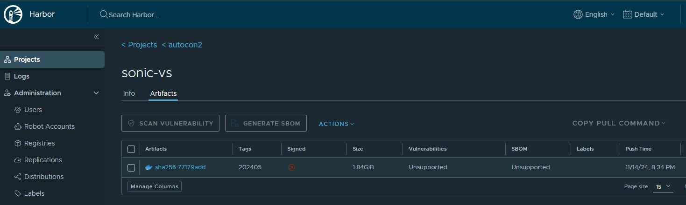

# Container registry and Containerlab

Containerlab is better when used with a container registry. No one loved to witness the uncontrolled proliferation of unversioned disk image (qcow2, vmdk) files shared via ftps, one drives and IM attachments.

We can do better!

Since containerlab deals with container images, it is natural to use a container registry to store them. Versioned, immutable, tagged and easily shareable with granular access control.

Whether you choose to use one of the public registries or a run a private one, the workflow is the same. Let's see what it looks like.

## Harbor registry

In this workshop we make use of an open-source registry called [Harbor](https://goharbor.io/). It is a CNCF graduated project and is a great choice for a private registry.

The registry has been already deployed in the workshop environment, but it is quite easy to deploy yourself in your own organization. It is a single docker compose stack that can be deployed in a few minutes.

The Harbor registry offers a neat Web UI to browse the registry contents, manage users and tune access control. You can log in to the registry UI like this:

<https://registry.wrkshpz.net>

using the `autoconuser` user and the password `Nokia2024!`.

Managing the harbor registry is out of the scope of this workshop.

## Pushing images to the registry

**This section is for reference only and you are not required to do this on your VM.**

### 1 Logging in to the registry

To be able to push and pull the images from the workshop's registry, you need to login to the registry.

```bash
docker login registry.wrkshpz.net
```

```
# username: autoconuser
# password: Nokia2024!
```

### 2 Listing local images

First, we need to identify the name of the image that we want to push to the registry. By listing the images in the local image store we can reliably identify the name of the image that we want to push.

```
docker images
```

On your system you will see a list of images, among which you will see:

```
REPOSITORY                      TAG          IMAGE ID       CREATED         SIZE
vrnetlab/sonic_sonic-vs         202405       9b419b0a2acf   2 weeks ago     6.37GB
```

This is the image that we built before and that we want to push to the registry so that next time we want to use it we won't have to build it again.

The image name consists of two parts:

- `vrnetlab/sonic_sonic-vs` - the repository name
- `202405` - the tag

Catenating these two parts together we get the full name of the image that we want to push to the registry.

### 3 Pushing the image to the registry

**This section is for reference only and you are not required to do this on your VM.**

Now that we know the name of the image that we want to push to the registry, we can push it.

We will use `docker push` to upload the image to the registry. Before this, let's tag the image with the name of the registry and a tag.

```bash
docker tag vrnetlab/sonic_sonic-vs:202405 registry.wrkshpz.net/autocon2/sonic-vs:202405
```

Now we can push the image to the registry.

```bash
docker push registry.wrkshpz.net/autocon2/sonic-vs:202405
```

Expected output - Note: The user `autoconuser` does not have permission to push to the registry and will receive a `permission denied` error. The below output is for a user with permission to push.

```bash
The push refers to repository [registry.wrkshpz.net/autocon2/sonic-vs]
626d14695d27: Pushed 
da133bfdd77f: Pushed 
2e873d5d18ac: Pushed 
0595fbac089d: Pushed 
c3548211b826: Pushed 
latest: digest: sha256:77179add9a22a308b675f6eb5956f01feba25cf15f07cda9e8fb36784881b96e size: 1371
```

## Listing images from the registry

Once the image is copied, you can see it in the registry UI.



## Using images from the registry

The whole point of pushing the image to the registry is to be able to use it in the future yourself and also to share it with others.

We will be using the SONiC image that is already in the registry.

Before we pull images from the registry, delete the sonic image in your local docker repo.

Get the Image ID for sonic image:

```bash
autoconuser@1:~$ docker images
REPOSITORY                               TAG       IMAGE ID       CREATED             SIZE
vrnetlab/sonic_sonic-vs                  202405    b91919a90761   About an hour ago   6.37GB
registry.wrkshpz.net/autocon2/sonic-vs   202405    b91919a90761   About an hour ago   6.37GB
ghcr.io/nokia/srlinux                    latest    eb2a823cd8ce   10 days ago         2.35GB
```

Destroy all running labs (or any labs using sonic image):

```bash
sudo clab des -a
```

Delete the sonic docker image (replace with the correct Image ID in your VM):

```bash
docker image rm -f b91919a90761
```

Run the `docker images` command again to verify that the sonic image is removed.

Next, we can modify the `vm.clab.yml` file to make use of the sonic image in the registry:

```bash
name: vm
 
topology:
  nodes:
    sonic:
      kind: sonic-vs
      image: registry.wrkshpz.net/autocon2/sonic-vs:202405
    srl:
      kind: nokia_srlinux
      image: ghcr.io/nokia/srlinux

  links:
    - endpoints: ["sonic:eth1", "srl:e1-1"]
```

Deploy the lab using:

```bash
cd ~/ac2-clab/20-vm
sudo clab dep -t vm.clab.yml
```

Expected output:

```bash
INFO[0000] Containerlab v0.59.0 started                 
INFO[0000] Parsing & checking topology file: vm.clab.yml 
INFO[0000] Removing /home/autoconuser/ac2-clab/20-vm/clab-vm directory... 
INFO[0000] Creating docker network: Name="clab", IPv4Subnet="172.20.20.0/24", IPv6Subnet="3fff:172:20:20::/64", MTU=1500 
INFO[0000] Pulling registry.wrkshpz.net/autocon2/sonic-vs:202405 Docker image 
INFO[0000] Done pulling registry.wrkshpz.net/autocon2/sonic-vs:202405 
INFO[0000] Creating lab directory: /home/autoconuser/ac2-clab/20-vm/clab-vm 
INFO[0000] Creating container: "sonic"                  
INFO[0000] Creating container: "srl"                    
INFO[0000] Created link: sonic:eth1 <--> srl:e1-1       
INFO[0000] Running postdeploy actions for Nokia SR Linux 'srl' node 
INFO[0011] Adding containerlab host entries to /etc/hosts file 
INFO[0011] Adding ssh config for containerlab nodes     
+---+---------------+--------------+-----------------------------------------------+---------------+---------+----------------+----------------------+
| # |     Name      | Container ID |                     Image                     |     Kind      |  State  |  IPv4 Address  |     IPv6 Address     |
+---+---------------+--------------+-----------------------------------------------+---------------+---------+----------------+----------------------+
| 1 | clab-vm-sonic | 73b965cf476b | registry.wrkshpz.net/autocon2/sonic-vs:202405 | sonic-vm      | running | 172.20.20.2/24 | 3fff:172:20:20::2/64 |
| 2 | clab-vm-srl   | 9d1ad7c47715 | ghcr.io/nokia/srlinux                         | nokia_srlinux | running | 172.20.20.3/24 | 3fff:172:20:20::3/64 |
+---+---------------+--------------+-----------------------------------------------+---------------+---------+----------------+----------------------+
```

In the above output, we see that the sonic image was pulled from the registry.

Not only this gives us an easy way to share images with others, but also it enables stronger reproducibility of the lab, as the users of our lab would use exactly the same image that we built.
